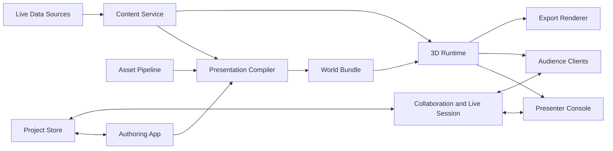

# Spatial Presentation Framework Design

**Status:** living design document · **Companion docs:** [proposal.md](proposal.md) (path from MVP 1 to a reusable, AI-authorable framework), [README.md](../spatial-present/README.md) (what runs today)

## Summary

This document proposes a presentation framework that removes the slide as the core unit of thought. Instead of advancing through rectangular pages, a presentation becomes a guided journey through a continuous 3D world: a garden, palace, observatory, museum, city, neural landscape, factory floor, microscopic organism, or any other spatial metaphor that fits the story.

The presenter controls a camera through this world. They can follow a planned route, branch to alternate routes, improvise, focus on meaningful objects, or zoom through scale portals from architectural views down to microscopic details. Text, charts, code, data, images, video, and mathematics (LaTeX formulas, animated derivations) are not placed on slides. They are embedded into the environment as semantic content rendered through spatial forms: wall carvings, leaf pigments, constellations, holograms, floor mosaics, water ripples, machinery labels, animated particles, chalk on slate, or museum plaques.

Authoring is layered: a free-form brief, a declarative authoring spec, a canonical project document, and a code-first SDK are four interfaces to the same artifact, so AI, a visual editor, and hand-code can each take a presentation from any point.

The framework should feel closer to a visual tour guide, game engine, and cinematic data canvas than to PowerPoint or Prezi.

## Product Principles

1. Spatial first, not slide first.
   The base artifact is a navigable world with semantic objects, camera routes, and content anchors. A linear export can exist, but it is a derived view.

2. Presenter agency.
   The presenter can follow a rehearsed path or depart from it without breaking the experience. The system should support both scripted cinematic beats and live exploration.

3. Content remains structured.
   A chart painted on a leaf is still a chart. A paragraph carved into stone is still accessible text. Visual treatments should not destroy semantics, searchability, editing, export, or accessibility.

4. Worlds are templates, not one-off art projects.
   Authors should start from reusable spatial environments and skins. The authoring experience must make fancy output possible without requiring every user to become a 3D artist.

5. Beautiful degradation.
   The primary mode is real-time 3D. Fallbacks should include 2D outline view, video recording, static snapshots, PDF-like handouts, and reduced-motion rendering.

6. Scale is a storytelling tool.
   The framework should support macro, human, object, and micro scales in one narrative. Moving from palace hall to inscription to pigment grain should be a first-class transition.

7. AI-native, but not AI-only.
   AI can generate worlds, routes, skins, camera moves, and first drafts. The output must still compile to readable project files and framework code that humans can inspect, edit, diff, test, and version.

8. Hand-code remains a power path.
   Advanced authors should be able to create a presentation with TypeScript, JSON, MDX, procedural scene code, and reusable framework APIs, without opening the visual editor or invoking AI.

9. Describe what, not where.
   Authors and AI reference named stations and camera intents ("the lecture-hall blackboard", "wide-establishing"), never raw coordinates or hand-tuned poses. World templates publish slots; a layout solver and camera planner own the geometry. Language models are poor at raw `[x, y, z]` and good camera framing, so this principle is what makes the format AI-authorable. Raw transforms remain available as a code-first escape hatch.

## Core Concepts

### World

A `World` is the continuous 3D environment. It contains terrain, architecture, lighting, ambience, physical scale, interaction constraints, and content-bearing surfaces.

Examples:

- A museum where each wing represents a product area.
- A garden where each plant species represents a business metric.
- A palace where rooms encode chapters and murals encode data.
- A space observatory where constellations become network graphs.
- A microscopic cell where organelles become system components.

### Anchor

An `Anchor` is a semantic point of interest in the world. It is not a slide. It is a location, object, volume, surface, or scale level that can receive content and camera focus.

Examples:

- A carved wall showing a quarterly revenue chart.
- A leaf whose veins animate as a dependency graph.
- A miniature model on a table that expands into an explorable city.
- A cloud formation that morphs into a quote.
- A gemstone that, when approached, reveals microscopic layers of information.

### Station

A `Station` is a named content slot published by a world template: a transform plus a content envelope (maximum size, facing direction). Authors and AI reference stations symbolically — `hall.blackboard.center`, `museum.west-wing.plinth` — and the layout solver resolves them to anchor transforms and avoids collisions. Stations keep raw coordinates out of prompts, specs, and generated documents.

### Camera Intent

A `CameraIntent` is a named framing — `wide-establishing`, `orbit-focus`, `read-close` — published by a world template or the core library. The camera planner converts an intent plus the focused content's bounds into a concrete `CameraPose` or path, removing the need to hand-author poses. Explicit poses remain a code-first escape hatch.

### Beat

A `Beat` is a presentable moment: a camera pose, focus target, reveal state, narration cue, and optional interaction. Beats can be ordered for rehearsed delivery, but they are nodes in a graph rather than pages in a list.

### Route Graph

The `RouteGraph` connects beats and anchors. It supports:

- Main narrative path.
- Optional branches.
- Jump links.
- Return points.
- Presenter bookmarks.
- Audience-driven branches for workshops or demos.
- Scale transitions from one level of detail to another.

### Content Primitive

A `ContentPrimitive` is structured information before it becomes visual:

- Text.
- Chart.
- Table.
- Diagram.
- Code.
- Formula (LaTeX source with spoken-math fallback).
- Math animation (Manim scene, rendered by the asset pipeline).
- Image.
- Video.
- 3D model.
- Data query.
- Live metric.
- Poll or interactive control.

### Spatial Skin

A `SpatialSkin` transforms structured content into an environmental form.

Examples:

- Text -> stone engraving.
- Bar chart -> garden columns.
- Line chart -> glowing river path.
- Scatter plot -> stars in a sky dome.
- Table -> museum display case.
- Code -> floating etched glass.
- Quote -> cloud particles.
- KPI -> sundial face.
- Formula -> chalk strokes on slate, etched glass, or glowing neon line work.
- Math animation -> projection on a lecture screen or frameless volumetric panel.

The skin owns style, materials, shader effects, and reveal animation. The primitive owns data and semantics.

### Scale Portal

A `ScalePortal` connects two coordinate spaces with different scales. It can be literal, like entering a doorway, or cinematic, like zooming into ink particles on a page.

Examples:

- Zoom into a map city to inspect a building.
- Fly into a leaf cell to show biological detail.
- Enter a data point to reveal its source records.
- Move from product overview to a microscopic architecture trace.

## User Experience

### Author Experience

The author works in a 3D editor with three main layers:

1. World layer.
   Choose or create an environment, import glTF assets, set lighting, define scale zones, and mark safe camera regions.

2. Content layer.
   Add text, charts, diagrams, media, or live data. Bind each item to an anchor. Choose a spatial skin.

3. Journey layer.
   Create beats, route graph edges, camera paths, reveal states, branches, and presenter controls.

The author should be able to toggle between:

- Free 3D editing.
- Route map.
- Content outline.
- Accessibility outline.
- Performance budget view.
- Presenter rehearsal.

### Presenter Experience

The presenter sees:

- Main viewport.
- Route graph minimap.
- Current beat and next recommended beats.
- Search and jump command palette.
- Camera controls with safe focus targets.
- Speaker notes.
- Timer.
- Audience view status.
- Manual override for free-fly mode.

The presenter can:

- Follow the default path.
- Branch to another anchor.
- Zoom into detail.
- Orbit an object.
- Reveal or hide content layers.
- Pause motion.
- Draw attention with pointer or spotlight.
- Let the audience explore after the guided part.

### Audience Experience

Audience members can join in multiple modes:

- Follow mode: audience camera mirrors the presenter.
- Explore mode: audience can inspect nearby objects while presenter continues.
- Companion mode: audience sees accessible text, transcript, and references on a second screen.
- Workshop mode: audience votes or chooses branches.
- Self-guided mode: a narrated, auto-advancing tour with no presenter — kiosk display or asynchronous viewing after the live talk.

## Creation Model

The framework should support three creation paths — AI, visual editing, and hand-code — that all produce the same underlying project model.

### Layered Input Model

Do not invent a single natural-language DSL that users must learn. A brittle "presentation prompt grammar" would be hard to write, hard to validate, and hard to diff. Instead, expose four layers that all target the same canonical document, so an author can enter at whatever altitude suits them and AI is always constrained by a real schema:

```
 Layer A   Free-form brief            "A 20-min talk on the Fourier transform for
 (human)   (prose + light structure)   undergrads. Use a concert-hall metaphor."
              │  AI generator (LLM + framework knowledge)
              ▼
 Layer B   Authoring Spec             declarative *intent*: sources, world choice,
 (AI ⇄      (YAML / MDX front-matter)  ordered scenes, content refs, skin hints.
  human)                               High-level, lossy, human-editable. ← the real
                                        "prompt language": you describe WHAT, not WHERE.
              │  compiler: layout solver + skin resolver + camera planner
              ▼
 Layer C   Project Document           the canonical, fully-resolved artifact the
 (contract) project.spatial.json       runtime renders. Validated by schema + graph rules.
              ▲  defineJourney() / SDK
              │
 Layer D   Code-first SDK             TypeScript/TSX for power users who want exact
 (human)   defineJourney({...})        control.
```

Key rules:

- The canonical document (Layer C) is the contract. AI, the visual editor, and hand-code all produce it. If a generated artifact fails validation, it is rejected — AI cannot emit something the runtime cannot render.
- The "prompt language" the user actually touches is Layer A (prose) and Layer B (intent spec) — never raw 3D coordinates. Layer B is declarative and positionless: it says "put the heat-equation derivation on the main blackboard," not "place it at `[6, 2, -4]`." The compiler resolves stations to coordinates and frames cameras.
- It is a set of APIs and a format. Layer C/D is the API (typed SDK + JSON Schema). Layer B is the format. Layer A is the prompt. They are three interfaces to one artifact.

### The Authoring Spec

The intent spec is the linchpin of AI authoring. AI is reliable at *what goes where in the story* and unreliable at *3D geometry*, so the spec lets AI choose from named, semantic slots a world template exposes, while the framework owns the geometry:

```yaml
# talk.spec.yaml — Layer B, what AI emits and humans tweak
title: The Fourier Transform
world: lecture-hall              # a registered template
audience: undergraduate
theme: chalk-on-slate
sources:
  - content/heat-equation.mdx
  - data/spectrum.csv
scenes:
  - id: intro
    station: hall.lectern        # a NAMED slot, not coordinates
    show: { text: content/intro.mdx, as: engraving }
    camera: wide-establishing    # a NAMED camera intent, not a pose
    narrate: "By 1822 Fourier had noticed something strange about heat."
  - id: heat
    station: hall.blackboard.center
    show: { formula: "\\frac{\\partial u}{\\partial t}=\\alpha\\nabla^2 u", as: chalkboard }
    next: fourier
  - id: fourier
    station: hall.blackboard.center
    show: { manim: scenes/fourier_decompose.py#FourierDecompose, as: projection }
    reveal: stepwise             # beat advances step through the Manim animation
```

The compiler turns `hall.blackboard.center` plus content size into a real transform, and `wide-establishing` into a `CameraPose` framed against the content's bounds.

### AI-Assisted Creation

AI can act as the first-draft producer and iterative design partner.

Example flow:

1. Author provides a goal, source material, brand direction, and preferred world metaphor.
2. AI emits an Authoring Spec, grounded by the registries (so it can only reference real worlds, stations, skins, and camera intents) and the JSON Schema (structured output).
3. The compiler runs the layout solver, skin resolver, and camera planner to produce the canonical project document, then validates it. Invalid output is repaired or rejected, never rendered.
4. The asset pipeline renders generated assets (formula textures, Manim clips, AI imagery).
5. Author reviews a semantic diff — what changed at the document level, not pixels — and accepts, edits, or regenerates parts.
6. The accepted result becomes normal project source.

AI output should never be only pixels or an opaque binary scene. It should create structured artifacts:

- `talk.spec.yaml` for declarative authoring intent.
- `project.spatial.json` for worlds, anchors, beats, routes, and content bindings.
- `content/*.mdx` for text-heavy authored content.
- `data/*.json` or `data/*.csv` for chart and table inputs.
- `scenes/*.py` for Manim scenes.
- `skins/*.ts` for custom spatial skins.
- `worlds/*.tsx` or `worlds/*.ts` for procedural scene logic.

### Visual Authoring

The editor is the approachable path. Users manipulate the same project model through direct interaction:

- Place anchors in 3D.
- Drag camera paths.
- Select spatial skins.
- Edit route graph edges.
- Preview reveal states.
- Ask AI to improve a selected object, path, skin, or world region.

The visual editor should save deterministic project files, not just a proprietary database blob.

### Code-First Authoring

Hand-code should be a first-class workflow for technical authors, teams, agencies, educators, and data storytellers who want precise control.

Example code-first shape:

```tsx
import { defineJourney, world, station, beat, route } from "@spatial-present/core";
import { MuseumWorld, Engraving, HologramChart } from "@spatial-present/templates";

export default defineJourney({
  title: "Quarterly Strategy Tour",
  worlds: [
    world("museum", MuseumWorld({ theme: "marble-night" })),
  ],
  anchors: [
    station("museum.entrance.lectern", {
      content: <Engraving markdown="./content/opening.mdx" />,
    }),
    station("museum.west-wing.feature-wall", {
      content: <HologramChart data="./data/revenue.csv" />,
    }),
  ],
  beats: [
    beat("opening", { anchor: "museum.entrance.lectern", camera: "wide-establishing" }),
    beat("revenue", { anchor: "museum.west-wing.feature-wall", camera: "orbit-focus" }),
  ],
  routes: [
    route("opening", "revenue", { kind: "primary", transition: "fly" }),
  ],
});
```

Note `station(...)` instead of raw `position: [x, y, z]` — the world template resolves the slot, and named camera intents replace hand-authored poses. Raw `anchor(..., { position })` and explicit `CameraPose` values remain available as escape hatches for exact control.

The code-first workflow should include:

- TypeScript SDK.
- JSON Schema for project documents.
- CLI compiler.
- Local preview server.
- Asset optimizer.
- Snapshot tests for route graphs and accessibility output.
- Optional React components for custom content primitives.
- Plugin API for custom skins, transitions, and camera planners.

The key rule: AI, visual editing, and hand-code are different interfaces to the same artifact.

## System Architecture



### Main Components

#### Authoring App

The authoring app is a browser-based 3D editor. It provides scene editing, route graph editing, content placement, preview, asset management, and collaboration.

Responsibilities:

- Create and edit worlds.
- Place anchors.
- Bind content primitives to anchors.
- Select spatial skins.
- Edit beats and transitions.
- Validate accessibility.
- Preview runtime performance.
- Package a world bundle.

#### Runtime Renderer

The runtime renderer plays the presentation. It loads a world bundle, renders the 3D scene, evaluates route graph state, handles presenter input, and synchronizes audience cameras.

Responsibilities:

- Real-time rendering.
- Camera path planning.
- Interaction and picking.
- Progressive asset loading.
- Shader and material effects.
- Content reveal states.
- Presenter and audience modes.
- Reduced-motion and fallback rendering.

#### Presentation Compiler

The compiler turns editable project state into an optimized runtime bundle.

Responsibilities:

- Validate schema.
- Resolve stations to anchor transforms and avoid collisions (layout solver).
- Plan camera poses and paths from named camera intents and content bounds (camera planner).
- Resolve or verify content-to-skin bindings against skin capability descriptors (skin resolver).
- Default a primary route chain from scene order, so authors and AI only add branches and portals.
- Resolve assets.
- Bake route graph.
- Precompute camera splines.
- Build spatial indexes.
- Generate text and chart textures when needed.
- Prepare LOD manifests.
- Compress meshes and textures.
- Emit accessibility metadata.

#### Registries and Plugin API

Three open registries keep the vocabulary extensible without editing the core:

- World templates: registered by id; each publishes named stations and camera intents.
- Spatial skins: `skinKind` mapped to a component plus a capability descriptor (which content kinds it accepts, size hints, whether it supports stepwise reveal).
- Content primitives: `kind` mapped to a schema, default skins, and a fallback renderer.

The registries serve both humans and AI: they are the menu of names a generator may reference, and the capability descriptors are what let the skin resolver auto-suggest a skin for a primitive.

#### Asset Pipeline

The asset pipeline manages heavy media, 3D assets, and generated assets referenced by the document. Generated assets are cached by content hash so recompiles are incremental.

Responsibilities:

- Import glTF/GLB assets.
- Optimize geometry.
- Generate LODs.
- Compress textures.
- Render LaTeX formulas to crisp textures (KaTeX to SVG/MSDF).
- Render Manim scenes offline to transparent video with cuepoints (`manim-render` job).
- Render narration scripts to audio with word timestamps and cue marks (`tts-narrate` job).
- Generate AI images and textures as cached jobs.
- Validate material compatibility.
- Generate thumbnails.
- Package environment templates.

#### Content Ingestion

Parsers turn real source material into content primitives (the Content Service in the diagram above):

- MDX/Markdown to `text`.
- CSV/JSON to `chart` and `table`.
- `.tex` and Markdown math to `formula`.
- Images and video to media primitives.
- `.py` Manim scenes to `manim` clips.

#### Live Session Service

The live session service synchronizes presenter state, audience state, collaboration edits, and session events.

Responsibilities:

- Presenter camera broadcast.
- Audience join/leave.
- Route branch votes.
- Collaborative editing.
- Presence and cursors.
- Session recordings.
- Analytics.

#### Export Renderer

The export renderer creates derived artifacts:

- Video walkthrough.
- Snapshot deck for handouts.
- PDF accessibility companion.
- Image thumbnails.
- Web embed.
- Offline bundle.

## Recommended Tech Stack

### Client and Authoring

| Layer | Recommendation | Reason |
| --- | --- | --- |
| Language | TypeScript | Shared schemas across editor, compiler, runtime, and services. |
| App framework | React | Mature ecosystem for complex editors and panels. |
| Build tool | Vite | Fast local iteration and modern browser targets. |
| 3D React bridge | React Three Fiber | Declarative scene composition using Three.js while staying in React. |
| UI state | Zustand or Jotai | Small, explicit state stores for editor tools and runtime panels. |
| Form/schema validation | Zod | Runtime validation for project documents and plugin payloads. |
| Timeline/graph UI | React Flow or custom canvas | Route graph, beat graph, and branching control. |
| Code-first API | TypeScript SDK, JSX/TSX authoring, JSON Schema | Lets teams hand-code presentations, review diffs, and keep projects in Git. |
| CLI | Node.js CLI | Compile, validate, preview, optimize assets, export, and run CI checks. |

### Rendering

| Layer | Recommendation | Reason |
| --- | --- | --- |
| 3D engine | Three.js | Large ecosystem, glTF support, WebXR support, broad web deployment path. |
| Renderer target | WebGPU through Three.js where available, WebGL2 fallback | WebGPU is the forward-looking target for advanced scenes; fallback protects broad audience access. |
| Scene integration | @react-three/fiber and @react-three/drei | Faster componentized world building, controls, loaders, helpers, and reusable presentation objects. |
| Text rendering | SDF/MSDF text, e.g. Troika-style text meshes | Crisp 3D text with scale and perspective support. |
| Math typesetting | KaTeX to SVG/MSDF textures, MathJax for the long tail | Crisp, scalable formulas native to the 3D scene, with MathML output for accessibility. |
| Charts | ECharts or D3 rendered to SVG/canvas/texture, plus native 3D chart meshes for hero moments | Keeps chart semantics while enabling spatial skins. |
| Physics/camera constraints | Rapier or lightweight custom collision volumes | Prevents presenter camera from clipping through important geometry. |
| Shaders | Three.js node materials, GLSL/WGSL where needed | Enables clouds, engraving, holograms, fluids, particles, and scale transitions. |
| XR | WebXR as optional mode | Supports headset walkthroughs without making XR mandatory. |

### Assets

| Layer | Recommendation | Reason |
| --- | --- | --- |
| 3D asset format | glTF/GLB 2.0 | Standard runtime delivery format for web 3D scenes. |
| Authoring tools | Blender, Figma, procedural generators | Blender for spatial assets, Figma for 2D design inputs, generators for environment templates. |
| Mesh compression | Draco and Meshopt | Smaller downloads and faster startup for complex worlds. |
| Texture compression | KTX2/Basis Universal | GPU-friendly compressed textures across devices. |
| Math animation | Manim rendered offline by the asset pipeline | Full Manim power, rendered once with alpha and cuepoints, cached by content hash, streamed as an ordinary timed asset. |
| Narration audio | TTS rendered offline by the asset pipeline (local Kokoro/Piper, or cloud voices such as ElevenLabs/OpenAI/Azure) | Scripts stay the semantic source; audio with word timestamps and cue marks is a cached, swappable derived asset. |
| Asset storage | S3-compatible object storage | Large binary assets should not live in the database. |

### Backend

| Layer | Recommendation | Reason |
| --- | --- | --- |
| API | Node.js with Fastify or NestJS | TypeScript end to end, good WebSocket and validation support. |
| Database | Postgres | Projects, users, versions, metadata, permissions, analytics. |
| Realtime | WebSocket service | Presenter/audience synchronization and collaborative editing. |
| Collaboration | Yjs CRDT documents | Conflict-free editing for world graph, route graph, and text content. |
| Jobs | Worker queue with Node or Rust workers | Asset optimization, video export, Manim rendering in sandboxed Python workers, AI-assisted world generation. |
| Search | Postgres full text first, dedicated search later | Search anchors, content, assets, notes, and semantic metadata. |
| CDN | Edge CDN in front of world bundles | Presentation startup depends heavily on asset delivery. |

### AI and Procedural Generation

AI should be an optional accelerator, not the core data model.

Potential uses:

- Generate first draft worlds from a theme.
- Convert outlines into route graphs.
- Suggest spatial skins for content.
- Create textures, murals, icons, and environmental details.
- Summarize long documents into anchor candidates.
- Generate presenter rehearsal paths.
- Generate accessibility descriptions for visual elements, with human review.

Required AI constraints:

- AI writes structured project artifacts, not only rendered output.
- AI generation is grounded in the registries: it can only reference worlds, stations, skins, and camera intents that actually exist, and it emits structured output against the JSON Schema.
- AI never emits raw coordinates or camera poses; it targets the positionless Authoring Spec and the compiler owns the geometry.
- Every AI change is shown as a semantic diff.
- Generated content can be edited visually or by hand.
- Prompts and generation settings are stored as provenance metadata.
- The compiler rejects invalid or inaccessible generated structures.
- The user can lock sections so AI does not rewrite hand-tuned worlds, skins, or camera paths.

## Data Model

The project file should be a versioned, portable document. Binary assets live separately and are referenced by content-addressed URLs or asset IDs.

```ts
type PresentationProject = {
  schemaVersion: string;
  id: string;
  title: string;
  worlds: World[];
  anchors: Anchor[];
  beats: Beat[];
  routes: RouteEdge[];
  content: ContentPrimitive[];
  skins: SpatialSkinBinding[];
  assets: AssetRef[];
  accessibility: AccessibilityMetadata;
};

type World = {
  id: string;
  name: string;
  unitScale: "macro" | "human" | "object" | "micro" | string;
  rootAssetId?: string;
  lighting: LightingPreset;
  navigationBounds: Bounds[];
  scalePortals: ScalePortal[];
};

type Anchor = {
  id: string;
  worldId: string;
  name: string;
  station?: string; // symbolic slot the transform was resolved from, e.g. "hall.blackboard.center"
  transform: Transform3D;
  bounds?: Bounds;
  semanticRole: "chapter" | "detail" | "chart" | "quote" | "demo" | "portal" | string;
  contentIds: string[];
};

type Beat = {
  id: string;
  anchorId: string;
  title: string;
  cameraIntent?: string; // named intent the pose was planned from, e.g. "wide-establishing"
  camera: CameraPose | CameraPath;
  focusTarget?: string;
  revealState: RevealInstruction[];
  narration?: NarrationSpec;
  notes?: string;
  durationHintMs?: number;
};

type NarrationSpec = {
  script: string; // semantic source; may contain inline cue marks like "[mark:show-chart]"
  voiceId?: string; // registered voice preset
  mode?: "voiceover" | "diegetic";
  emitterAnchorId?: string; // spatial audio source for diegetic mode
  autoAdvance?: boolean; // advance along the primary route when the clip ends
  rendered?: {
    assetId: string;
    durationMs: number;
    words?: { text: string; startMs: number; endMs: number }[];
    marks?: { name: string; atMs: number }[];
  }; // filled by the asset pipeline
};

type RouteEdge = {
  fromBeatId: string;
  toBeatId: string;
  label?: string;
  kind: "primary" | "branch" | "return" | "portal" | "free";
  transition: TransitionSpec;
};

type ContentPrimitive =
  | {
      id: string;
      kind: "text" | "chart" | "table" | "diagram" | "code" | "image" | "video" | "model" | "liveData";
      semanticData: unknown;
      fallbackText?: string;
      sourceRefs?: SourceRef[];
    }
  | {
      id: string;
      kind: "formula";
      latex: string; // semantic source, e.g. "\\int_{-\\infty}^{\\infty} f(x)e^{-2\\pi i x\\xi}\\,dx"
      display: "block" | "inline";
      numbered?: boolean;
      fallbackText: string; // spoken-math description for outline + screen readers
    }
  | {
      id: string;
      kind: "manim";
      scene: string; // "scenes/fourier.py#FourierDecompose" (file#ClassName)
      quality?: "l" | "m" | "h" | "k";
      transparent?: boolean; // alpha channel, composites into the 3D scene
      reveal?: "play" | "loop" | "stepwise";
      fallbackText: string; // describes the animation for the outline
      rendered?: { assetId: string; durationMs: number; cuepoints?: number[] }; // filled by the asset pipeline
    };

type SpatialSkinBinding = {
  id: string;
  contentId: string;
  anchorId: string;
  skinKind: "engraving" | "leafPaint" | "cloudText" | "hologram" | "mosaic" | "constellation" | "chalkboard" | "etchedGlass" | "neonManifold" | "projection" | string;
  materialParams: Record<string, unknown>;
  revealAnimation: AnimationSpec;
};
```

The canonical document stores both the resolved geometry and the symbolic source it came from (`station`, `cameraIntent`). This keeps documents re-flowable: when a world template changes, the compiler can re-resolve slots and re-plan cameras instead of stranding hand-baked coordinates.

## Runtime Model

### Camera System

The camera system should combine controlled cinematography with live navigation.

Core capabilities:

- Spline-based camera paths.
- Orbit focus around an anchor.
- Object tracking.
- Collision avoidance.
- Speed and acceleration limits.
- Motion sickness limits.
- Cut, fly, dolly, orbit, zoom, and scale-portal transitions.
- Manual override with return-to-route.

Internally, camera movement should be planned as transitions between camera constraints rather than fixed frame-by-frame animations. This lets the presenter interrupt safely.

### Route Graph

The route graph should be explicit, searchable, and visible to the presenter.

Recommended behavior:

- Each beat has a stable URL-like ID.
- Edges can be conditional.
- Branches can have labels.
- Presenter can jump by search.
- Audience mode follows authoritative presenter state.
- Session recording stores route events, not only video.

### Content Rendering

The renderer should separate semantic content from visual skin:

1. Evaluate content primitive.
2. Normalize to an intermediate content layout.
3. Apply spatial skin.
4. Render to mesh, texture, particle field, shader material, or overlay.
5. Preserve accessible fallback.

Examples:

- A text primitive can render as stone engraving, floating glass, cloud particles, or a simple readable panel.
- A chart primitive can render as an ECharts SVG texture for precision, or as native 3D bars for a dramatic reveal.
- A table primitive can render as a museum case, but still expose rows and columns to the companion view.
- A formula primitive can render as chalk on slate, etched glass, or glowing line work, while exposing MathML and spoken-math text to the companion view.

### Scale Transitions

Scale transitions are special route edges.

Implementation options:

- Nested worlds: each scale level is a separate world with a portal edge.
- Continuous worlds: same coordinate space with aggressive LOD and shader transitions.
- Hybrid: continuous camera illusion, but separate loaded scene chunks.

Recommended MVP: hybrid. Use a cinematic transition to hide loading and switch into a different world chunk with its own scale and assets.

## Mathematical Content

Math is a first-class content type, not a picture pasted on a wall. Two primitives cover it, and both keep a semantic LaTeX source so equations stay accessible, searchable, and exportable to the outline and handout.

### Static Formulas (LaTeX)

The `formula` primitive holds LaTeX source plus a spoken-math fallback. Rendering options, with the default in bold:

- **KaTeX to SVG/MSDF to textured plane.** Crisp at any zoom, lives natively in the 3D scene, works with skins and scale portals. KaTeX is fast and covers the vast majority of presentation math.
- KaTeX to a DOM overlay billboard. Perfect typography and selectable text, but it is a DOM layer that breaks occlusion and scale-portal immersion. Good as a high-contrast fallback or companion view.
- MathJax for the long tail of LaTeX that KaTeX cannot handle.

KaTeX can emit MathML; the outline view renders MathML (or the fallback text), so the equation survives into the linear, handout, and screen-reader paths — consistent with the rule that the fallback is derived, never the source.

Math skins: `chalkboard` (white chalk strokes on slate, subtle dust on reveal), `etchedGlass` (formula etched into a lit glass slab), `neonManifold` (glowing 3Blue1Brown-style line work on a dark void). A formula is still a formula under any of them.

### Animated Math (Manim)

Manim is a Python, offline renderer — it cannot run in the browser. So it integrates as an asset-pipeline job, never a runtime dependency. The `manim` primitive references a scene by `file#ClassName`; the `manim-render` job:

1. Hashes the scene source, Manim version, quality, and flags.
2. On cache miss, runs `manim render` in a sandboxed Python worker; with `transparent` it produces an alpha-channel video so the animation composites over the world instead of a black rectangle.
3. Optionally emits an image sequence plus cuepoints so beats can scrub it.
4. Registers the output as an `AssetRef` and stores provenance (scene hash, version) on the node.

In-world, a `projection` skin plays the clip on a lecture screen, a floating slab, or a frameless volumetric panel. With transparency, glowing Manim graphics float in a dark math void with no visible frame.

Stepwise reveal is the powerful bit: beat advancement maps to Manim animation time. Manim scenes are sequences of `self.play(...)` steps; if the job emits cuepoints at each `play` boundary, pressing next at a beat advances the clip to the next cuepoint instead of moving the camera. The presenter walks a derivation one transformation at a time, inside the spatial world. This reuses the existing reveal-state concept on `Beat`.

### Math World Templates

Ship templates that give AI good defaults for math talks: `math-void` (dark, glowing graphs), `lecture-hall` (board, projector, seats), `number-line-promenade`, and `geometry-garden` (proofs as growing constructions).

### Division of Labor

- LaTeX in-browser (KaTeX) handles static formulas: instant, scalable, accessible, no build step.
- Manim offline handles animated and visual math: the full power of Manim, rendered once, cached, streamed. The framework treats the result as just another timed asset, so presenter controls, fallbacks, and exports all work unchanged.

## Voice Narration

Modern TTS makes narrated tours cheap to produce, so narration is a first-class beat property, not an afterthought. The design follows the same pattern as Manim: the script is the semantic source of truth, audio is a derived asset rendered offline by the pipeline, and timing metadata makes the result steerable at runtime.

### Narration Model

Each beat may carry a narration spec: a script (plain text, optionally with inline cue marks), a voice preset, and a playback mode. The script — not the audio file — is the source of truth. Captions, the transcript in the companion view, the handout text, and translations are all derived from it, consistent with the rule that the fallback is derived, never the source.

Playback modes:

- Voiceover: non-diegetic narration over the scene, ambience ducked underneath.
- Diegetic: the voice emanates from a position in the world — a guide character, a statue, a positional speaker at the anchor — using spatial audio, so the tour feels like a museum audio guide.

### The `tts-narrate` Job

Narration audio is produced by an asset-pipeline job, never synthesized live in the runtime:

1. Hash the script, voice preset, engine, and settings; on cache hit, reuse the cached clip.
2. On miss, render with the configured engine. Engines are pluggable behind the job: local open models (Kokoro, Piper) for zero-cost iteration, cloud voices (ElevenLabs, OpenAI, Azure) for premium delivery. Swapping engines is a re-render, not a document change.
3. Emit word- and sentence-level timestamps, plus a timestamp for each inline cue mark in the script. Engines that do not report timings get forced alignment as a fallback.
4. Register the clip as an `AssetRef` with provenance (script hash, engine, voice, version).

### Synchronization

Timing metadata is what makes narration more than a soundtrack:

- Cue marks in the script (for example `[mark:show-chart]`) trigger reveal states, spotlight moves, or camera intents at the exact word they annotate — the narration drives the scene the way Manim cuepoints drive stepwise reveal.
- Word timestamps drive synchronized caption highlighting.
- Auto-advance: when a beat's clip ends, the tour can advance along the primary route after a configurable pause. This turns any presentation into a self-running narrated tour — kiosk mode, asynchronous viewing, or an audience replay after the live talk.

The presenter always wins: in live presenter mode narration is off by default (or used for rehearsal pacing), and any manual input pauses auto-advance immediately. Narration must never wrest the camera from a presenter.

### Authoring and AI

In the Authoring Spec, narration is one line per scene (`narrate: "By 1822 Fourier had noticed something strange about heat."` or `narrate: content/intro-narration.md`), plus a project-level voice choice. The AI generator can draft narration scripts from the same source material it uses for content extraction — narration is the natural Layer B output of a "make this a self-guided tour" prompt. Scripts are ordinary text in the project source: diffable, editable, lockable, and translatable. A localized presentation is the same document with per-locale narration tracks rendered by the same job.

## Authoring Workflow

1. Create project from AI prompt, authoring spec, visual editor, or code template.
2. Choose or generate a world template, such as museum, garden, palace, observatory, city, lecture hall, or microscopic landscape.
3. Import, generate, or hand-code assets.
4. Add content primitives from text, markdown, MDX, CSV, JSON, images, charts, documents, code, LaTeX math, Manim scenes, or live data.
5. Place anchors by referencing named stations, visually in the editor, or by defining transforms in source.
6. Bind content to anchors.
7. Choose, generate, or implement spatial skins.
8. Create beats, with narration scripts where the tour should speak for itself.
9. Connect beats into route graph.
10. Rehearse in presenter mode.
11. Run accessibility and performance checks.
12. Commit source artifacts, publish a web presentation bundle, or export derived formats.

## Accessibility and Fallbacks

This framework must not rely on visual spectacle alone.

Required accessibility features:

- Linear outline view generated from route graph.
- Searchable text equivalent for every spatial content object.
- Captions and transcripts derived from narration scripts, with word-timestamp highlighting.
- Speaker notes.
- Keyboard navigation.
- Reduced-motion mode.
- High-contrast mode.
- Screen-reader companion document.
- Static snapshot export.
- Video export with captions.
- Focus-safe camera movement with configurable speed.

The important design constraint: the fallback is not the source of truth. The spatial world is the source of truth, and the fallback is derived from its semantic model.

## Performance Strategy

Target budgets:

- Initial interactive load: under 5 seconds for a typical broadband audience.
- Presenter mode: stable 60 FPS on mainstream laptops.
- XR mode: target 72 to 90 FPS depending on device.
- Scene chunk size: keep primary chunk small, stream secondary chunks.
- Text legibility: maintain readable screen-space sizes during camera movement.

Techniques:

- Progressive world loading.
- Route-aware preloading of next anchors.
- LOD meshes.
- Texture compression.
- GPU instancing for repeated scene elements.
- Occlusion and frustum culling.
- Baked lighting for static environments.
- Dynamic lighting only for focus moments.
- Web workers for parsing and data transforms.
- WASM for heavy layout, geometry, or simulation jobs if JavaScript becomes a bottleneck.
- Quality profiles for low, medium, high, and XR.

## Security and Trust

Potential risks:

- Untrusted project imports.
- User-uploaded assets.
- Custom shaders or plugins.
- Live data connectors.
- Audience interaction.

Controls:

- Validate project schema.
- Restrict executable plugin APIs.
- Sanitize text and HTML.
- Use signed asset URLs.
- Scan uploads where appropriate.
- Sandboxed preview for third-party worlds and skins.
- Explicit permissions for live data connectors.
- Versioned publishing with rollback.

## Suggested Repository Structure

```text
apps/
  authoring-web/
  runtime-web/
  presenter-console/
  export-worker/
packages/
  core/
  cli/
  schema/
  compiler/
  renderer-core/
  route-graph/
  layout-solver/
  camera-planner/
  spatial-skins/
  content-primitives/
  asset-pipeline/
  generator/
  collaboration/
  accessibility/
  example-worlds/
examples/
  svd-tour/
  code-authored-tour/
  ai-generated-garden/
  visual-editor-project/
services/
  api/
  realtime/
  jobs/
  asset-storage/
docs/
  design.md
```

## MVP Scope and Roadmap

The first credible MVP should prove the new mental model without trying to build the whole dream.

### MVP 1: Runtime Prototype — shipped

**Status: implemented as [`spatial-present/`](../spatial-present/README.md) ("Singular Value Decomposition — A Guided Tour").** A web runtime that loads one handcrafted world and supports:

- 10 to 20 anchors.
- Route graph navigation.
- Presenter-controlled camera.
- Text, chart, image, and video primitives.
- Three spatial skins: engraving, hologram, and constellation/cloud text.
- One scale portal.
- Linear fallback outline.

What it proved is the architecture: the project document as single source of truth, content separated from presentation, an explicit navigable route graph, working scale portals, and schema plus graph validation surfaced through a CLI. It also carries a prototype slice of the narration design: per-beat scripts in the document, a local TTS render script with hash-based caching and provenance, and caption/auto-advance playback (a foretaste of M4's `tts-narrate` job, without word timestamps or cue marks). What it is not yet is a framework — worlds, skins, and the journey live in one app, authoring requires hand-placed coordinates and camera poses, and there is no registry, generalized asset pipeline, AI generator, or math support.

### Milestones after MVP 1

Ordered roughly by leverage; see [proposal.md](proposal.md) for the full rationale.

| Milestone | Delivers | Unblocks |
| --- | --- | --- |
| **M1 — Packagize** | split core/renderer/skins/worlds/cli; the SVD tour as an example | clean seams for everything else |
| **M2 — Registries + layout solver + camera planner** | stations, named camera intents, auto-routing | **AI authoring becomes possible** (no hand coordinates) |
| **M3 — Math primitives** | `formula` (KaTeX to texture, MathML fallback) + `chalkboard`/`etchedGlass` skins; `math-void` + `lecture-hall` worlds | static math talks hand/SDK-authored |
| **M4 — Asset pipeline + Manim + narration** | `manim-render` job (transparent, cuepoints), `tts-narrate` job (timestamps, marks), `projection` skin, stepwise reveal | **animated math**; narrated self-running tours; generated-art caching |
| **M5 — AI generator** | prompt to Authoring Spec to document, grounded by registries + schema; provenance, locking, semantic diff | the "describe it and get a presentation" experience |
| **M6 — Visual editor** | direct manipulation over the same document | the approachable third path |

M2 (auto-layout and auto-framing) is the true unlock for AI authoring; M1 should come first because it makes the rest tractable. The live presentation layer — presenter/audience synchronization, session recording, branch votes — and the collaboration stack follow once the framework is reusable; their scope is unchanged from the System Architecture section above.

## Long-Term Capabilities

- Multi-presenter tours.
- Audience exploration after a talk.
- WebXR presentation mode.
- AI world generation from a narrative outline.
- Live data bindings.
- Procedural environments.
- Marketplace for worlds and spatial skins.
- Plugin SDK for custom content primitives.
- Native desktop companion for heavy authoring.
- Video editor style recording and postproduction.
- Spatial analytics: where presenters linger, where audiences look, where branches happen.

## Major Risks

### Authoring Complexity

The idea is powerful but can become too hard to author. The product needs templates, constraints, smart defaults, and AI assistance from day one.

### Presenter Disorientation

A 3D world can make presenters lose their place. The presenter console must always show where they are, what comes next, and how to return to the main route.

### Legibility

Fancy spatial text can become unreadable. The framework needs screen-space legibility rules, minimum contrast checks, and fallback readable surfaces.

### Performance

Large 3D worlds can overload audience devices. Route-aware loading, LOD, compression, and quality profiles are core architecture, not optional optimizations.

### Accessibility

Removing slides cannot mean removing accessible structure. The semantic content model is the protection against this.

### Design Taste

The framework could easily produce gimmicky output. Strong template art direction and restrained defaults matter as much as rendering features.

## MVP 1 Decisions

- First audience: education.
- Authoring target: browser-first. A desktop companion can be reconsidered later if heavy scene authoring becomes painful in the browser.
- AI role: AI can help author presentations, but the MVP should prove the manual source model, runtime, and compiler first.
- Collaboration: out of scope for MVP 1.
- World style: configurable rather than purely realistic or purely stylized.
- Minimum viable export: static web link or static web bundle. Video and handout exports should come later as derived formats.

## MVP 1 Implementation Readiness

MVP 1 has been implemented as [`spatial-present/`](../spatial-present/README.md). The boundaries below guided that implementation and are kept for the record; the implementation focused on the runtime prototype only, not the full authoring platform.

Recommended MVP 1 boundaries:

- Build a browser runtime with React, TypeScript, Three.js, and React Three Fiber.
- Use local source files for the project document, content primitives, route graph, and handcrafted world.
- Include a small CLI or build step only if needed to validate and bundle project data.
- Avoid backend services, realtime sync, persistent database, collaboration, marketplace, and heavy asset pipeline work.
- Publish or preview as a static web app.

MVP 1 success criteria:

- One handcrafted educational world loads in the browser.
- The world contains 10 to 20 anchors.
- A presenter can move through a nonlinear route graph.
- Camera movement supports scripted paths plus manual orbit/focus controls.
- Text, chart, image, and video primitives render in-world.
- At least three spatial skins exist: engraving, hologram, and constellation or cloud text.
- One scale portal convincingly moves from overview to detail.
- A linear fallback outline is generated from the same project model.

## Recommended Initial Direction

Start with a browser-first product:

- React + TypeScript for the authoring application.
- Three.js + React Three Fiber for rendering.
- WebGPU where available, WebGL2 fallback.
- glTF/GLB for 3D assets.
- Postgres and object storage for projects and assets.
- WebSockets for live sessions.
- Yjs for collaborative project editing.
- ECharts/D3 for chart semantics, rendered into spatial skins.
- TypeScript SDK, JSON Schema, and CLI compiler so presentations can be generated by AI, edited visually, or hand-coded in Git.

The first prototype should be a polished museum or garden world with a nonlinear route graph, one convincing scale portal, and a presenter console that makes improvisation feel safe. That will prove the core idea better than a broad but shallow editor.

## Reference Notes

- Three.js provides the practical browser 3D foundation, including current WebGPU/WebGL renderer paths and WebXR ecosystem support.
- React Three Fiber gives a React-native way to compose Three.js scenes declaratively.
- glTF/GLB 2.0 should be the default runtime asset format because it is an interoperable delivery format for real-time 3D.
- WebGPU is the forward-looking browser graphics API for high-performance rendering and GPU compute, with WebGL2 fallback required for audience reach.
- WebXR should be treated as optional extension capability rather than an MVP dependency.
- Yjs is a strong fit for collaborative editing because it provides CRDT-backed shared data types.
- ECharts and D3-style rendering can preserve chart semantics while allowing charts to become textures, meshes, or spatial visualizations.
- KaTeX provides fast in-browser LaTeX typesetting with MathML output for accessibility; MathJax covers the long tail of LaTeX that KaTeX cannot handle.
- Manim is a Python offline renderer and must be integrated as a build-time asset job emitting transparent video and cuepoints, never as a runtime dependency.
- TTS engines should sit behind the asset pipeline as pluggable backends (local Kokoro/Piper, cloud ElevenLabs/OpenAI/Azure); narration scripts remain the semantic source, and word timestamps or forced alignment provide the timing metadata for captions and cue-mark synchronization.
